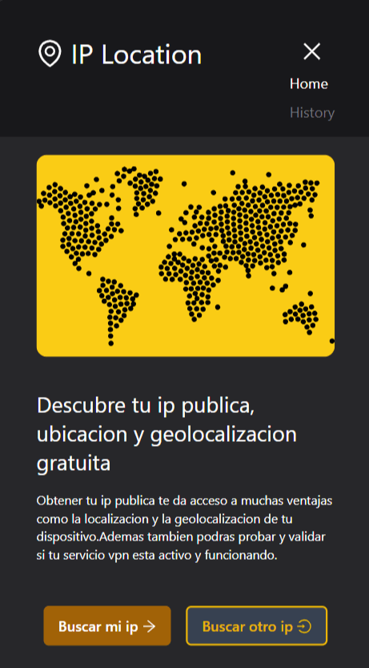
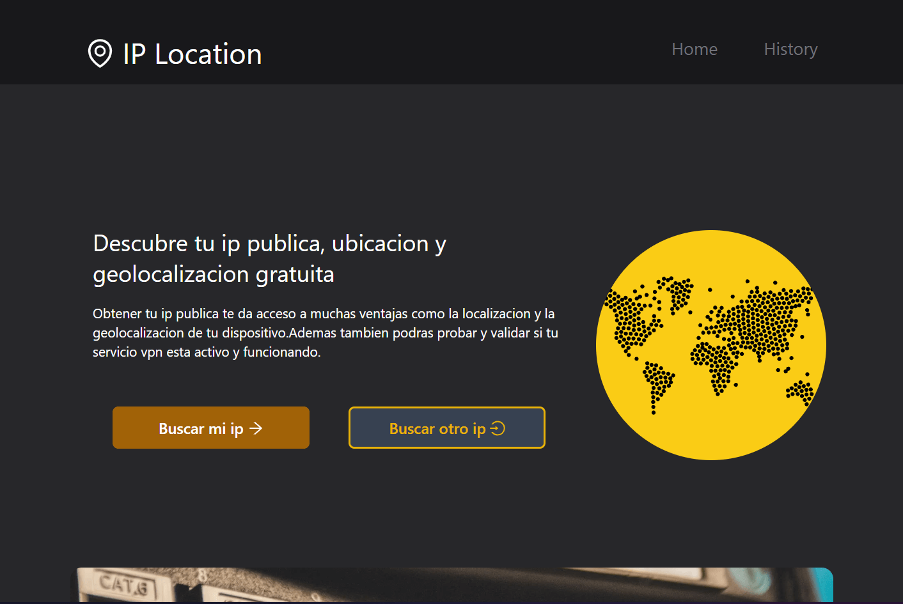
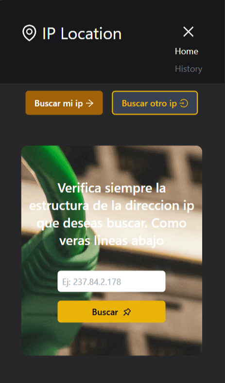
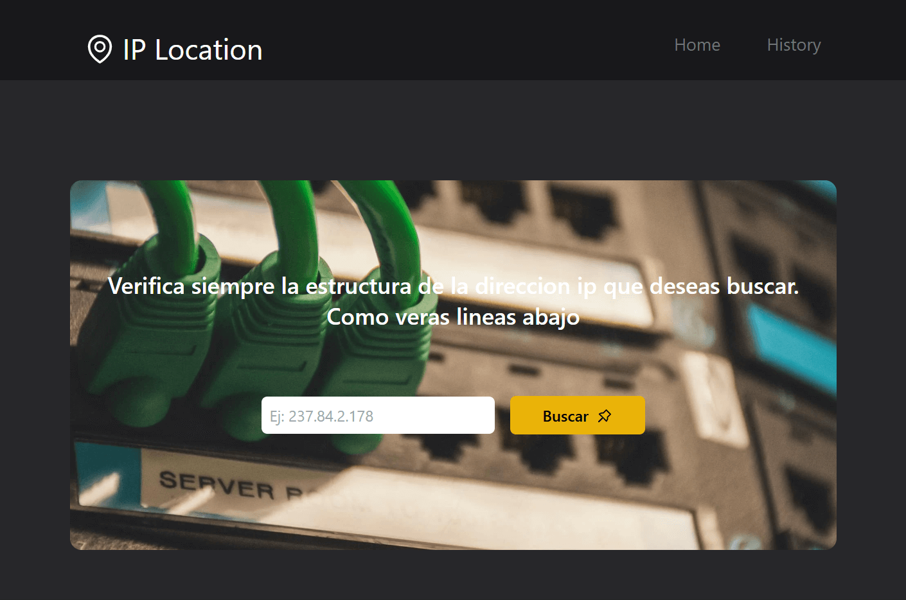
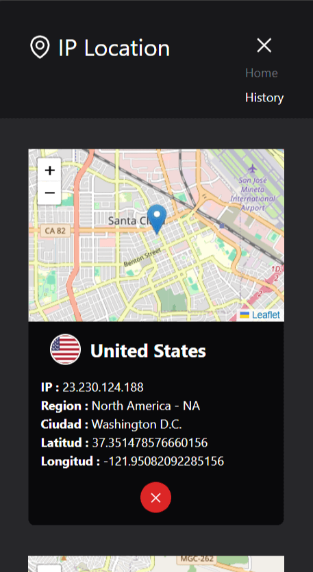
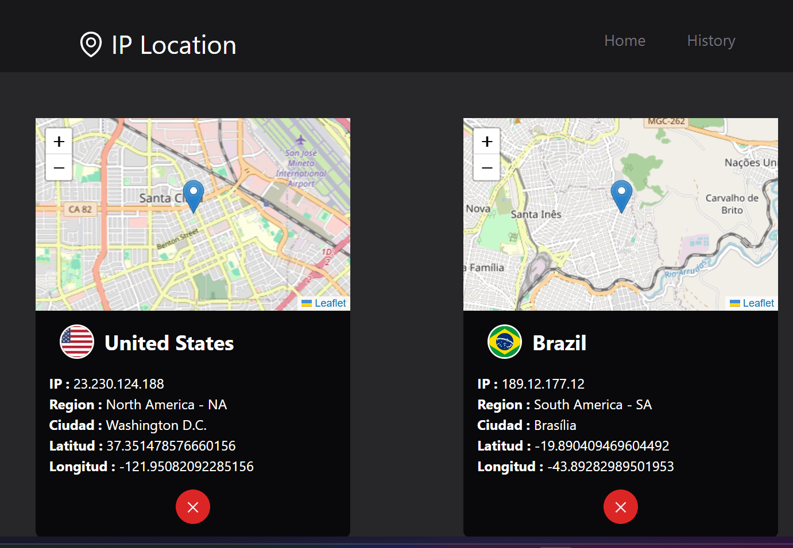

# Ip Global Location

[View the live project on Netlify](https://ip-global-location.netlify.app/)
# Project Description

This project is a web application that allows users to check their own IP address and get its geolocation using an API. Additionally, users can search for the geolocation of any other IP address.

*The homepage showing the IP and geolocation results.*

*The search feature allowing users to input any IP address and get its geolocation.*

*The search history feature, displaying previously saved queries and their results.

### Main Features:
- 🌐 **Geolocation of the current IP:** The web application retrieves the geolocation information of the IP from which the request is made using an API. This provides data such as approximate location, country, city, and more.
  
- 🔍 **Geolocation search by IP:** Users can enter any IP address to get its geolocation, offering the flexibility to check any IP of their choice.

- 💾 **Save searches:** All performed searches are stored in the local storage (localStorage). This ensures that the search history remains available even after closing or reloading the browser, and it will only be deleted if the user explicitly chooses to do so.

### Key Features:
- ⚡ **Simple and quick user interface.**
- 💾 **Search persistence via local storage.**
- 🌍 **Immediate access to the geolocation of any IP in real-time.**

### Technologies Used:
| Technology           | Description |
|----------------------|-------------|
| **React**            | JavaScript library for building interactive user interfaces. |
| **React Router DOM** | For routing between pages within the application. |
| **Axios**            | For making HTTP requests and handling responses. |
| **Leaflet**          | JavaScript library for creating interactive maps. |
| **React-Leaflet**    | A React wrapper for integrating Leaflet with React applications. |
| **Zod**              | TypeScript schema validation library to ensure data correctness and structure. |
| **Zustand**          | Simple and efficient state management library for React applications. |
| **Material UI**      | A React component library for UI elements like buttons, forms, and more. |
| **Ant Design Icons** | A high-quality icon set for user interfaces. |
| **Emotion**          | Libraries for styling in React: @emotion/react and @emotion/styled provide powerful and flexible ways to write styles in JavaScript. |
| **Motion**           | Animation library to enhance interactivity and the visual experience of the application. |

### Objective:
🎯 **The goal of this application is to provide a simple and fast way to check the geolocation of any IP address, while also offering a personalized search history to make future queries more convenient.**
## Credits:
This project uses the free API from [ipapi](https://ipapi.com/) to fetch geolocation data for IP addresses.

You can learn more about the API and its services on their official website: [ipapi](https://ipapi.com/).

## Contact

Feel free to reach out to me at [Gmail](mailto:carloseduardomontalvorodriguez@gmail.com) or follow me on [X](https://x.com/Kaedu18).
